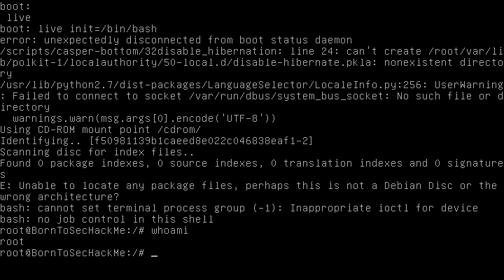

# Boot2Root - Bonus - Writeup 3

When the virtual machine boot, if we press **SHIFT** key, we can get the bootloader (grub) menu.

With the key **TAB**, we can get the list of boot partitions, then we choose the good one and launch it with the init binary `/bin/bash` to get a root shell and bypass the normal boot

